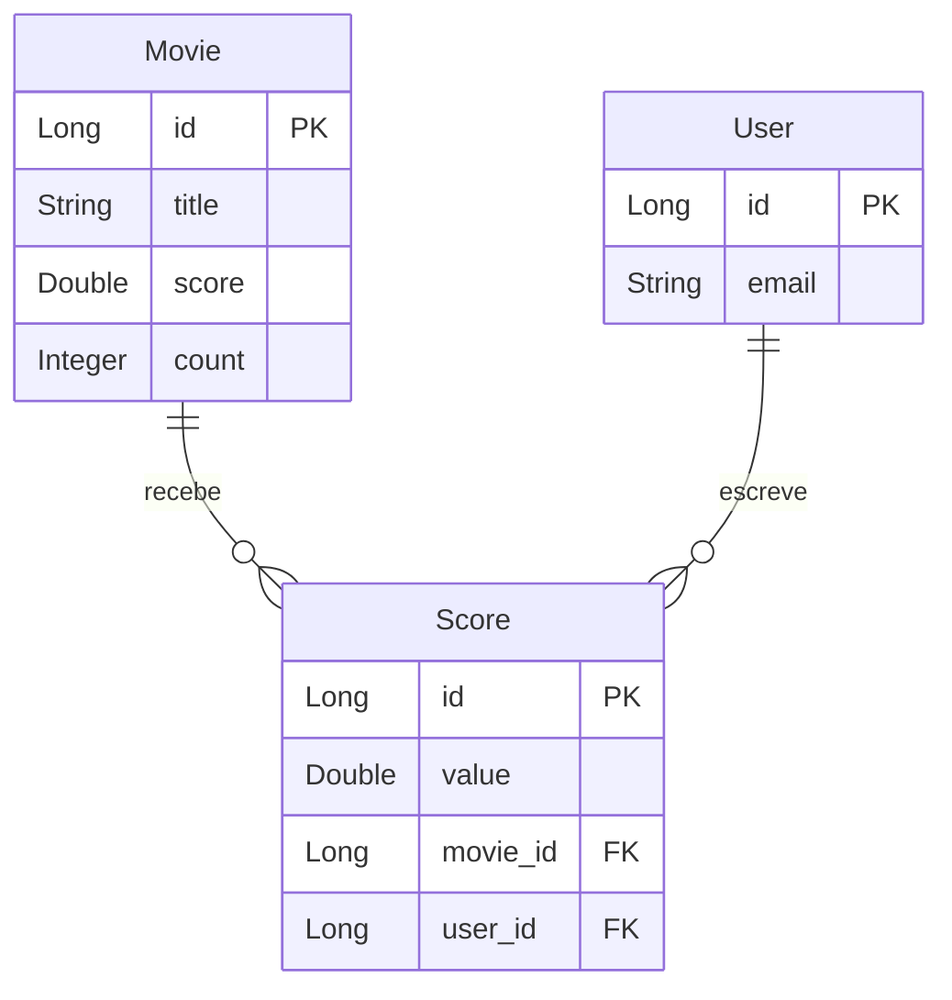

# Desafio DevSuperior - DSMovie com JaCoCo (Cobertura de Código)

[](https://openjdk.org/projects/jdk/17/)
[](https://spring.io/projects/spring-boot)
[](https://hibernate.org/)
[](https://www.h2database.com/)
[](https://www.jacoco.org/jacoco/)
[](https://junit.org/junit5/)
[](https://site.mockito.org/)
[](https://github.com/Jacques-Trevia/desafio-dsmovie-jacoco/blob/main/LICENSE)

## 📖 Sobre o Projeto

Este repositório contém a resolução de um **desafio avançado** do curso **Java Spring Expert** da DevSuperior, com um foco específico em **qualidade de software**: a implementação e medição de **cobertura de código** utilizando a ferramenta **JaCoCo** (Java Code Coverage).

O projeto **DSMovie** é uma API para avaliação de filmes (similar ao desafio MovieFlix), mas o diferencial aqui é a ênfase em:
- **Testes unitários** abrangentes com JUnit 5 e Mockito
- **Testes de integração** com Spring Boot
- **Relatórios de cobertura** gerados pelo JaCoCo
- **Meta de cobertura** (ex: 80% ou 100% para classes críticas)

## 🎯 Objetivo do Desafio

Aprender na prática como:
- Configurar o **JaCoCo** em um projeto Spring Boot Maven
- Gerar **relatórios de cobertura de código** (HTML, XML, CSV)
- Interpretar métricas de cobertura (instruções, branches, linhas, métodos)
- Escrever **testes estratégicos** para atingir metas de cobertura
- Identificar **código morto** ou não testado
- Integrar **análise de cobertura** ao pipeline de CI/CD

## ✨ Funcionalidades do DSMovie

### Gestão de Filmes
- **Listagem paginada de filmes**: Com busca por título
- **Busca de filme por ID**: Detalhes completos

### Sistema de Avaliação
- **Usuários podem avaliar filmes**: Nota (score) da avaliação
- **Cálculo da pontuação média**: Atualização automática
- **Validações**: Nota entre 0 e 4

### Cobertura de Código com JaCoCo
- **Relatório detalhado**: Porcentagem de cobertura por classe/pacote
- **Métricas**: Instruções (linhas), branches (condicionais), métodos, classes
- **Cobertura alvo**: Configurável via Maven plugin

## 🚀 Tecnologias Utilizadas

- **Java 17**: Linguagem de programação.
- **Spring Boot 2.7.x**: Framework principal.
- **Spring Data JPA**: Abstração para acesso a dados.
- **Hibernate**: Implementação do JPA.
- **H2 Database**: Banco de dados em memória para testes.
- **JUnit 5**: Framework de testes unitários.
- **Mockito**: Mocking para testes isolados.
- **JaCoCo**: Medição de cobertura de código.
- **Maven**: Gerenciador de dependências e build.
- **Postman**: Teste da API (coleção e environment incluídos).

## 📁 Estrutura do Projeto
```
src/
├── main/
│ ├── java/com/jacques/desafiodsmoviejacoco/
│ │ ├── DesafioDsmovieJacocoApplication.java # Classe principal
│ │ ├── controllers/ # Endpoints REST
│ │ │ ├── MovieController.java
│ │ │ └── ScoreController.java
│ │ ├── dto/ # Objetos de transferência
│ │ │ ├── MovieDTO.java
│ │ │ ├── ScoreDTO.java
│ │ │ └── ScoreInsertDTO.java
│ │ ├── entities/ # Entidades JPA
│ │ │ ├── Movie.java
│ │ │ └── Score.java
│ │ ├── repositories/ # Camada de acesso a dados
│ │ │ ├── MovieRepository.java
│ │ │ └── ScoreRepository.java
│ │ ├── services/ # Camada de negócio
│ │ │ ├── MovieService.java
│ │ │ ├── ScoreService.java (100% coberto!)
│ │ │ └── exceptions/ # Tratamento de exceções
│ └── resources/
│ ├── application.properties # Configuração do H2 e JPA
│ └── import.sql # Dados de teste
└── test/ # Testes (core do desafio!)
└── java/com/jacques/desafiodsmoviejacoco/
├── controllers/ # Testes de controller
│ ├── MovieControllerTest.java
│ └── ScoreControllerTest.java
├── services/ # Testes de serviço
│ ├── MovieServiceTest.java
│ └── ScoreServiceTest.java (100% coverage)
└── repositories/ # Testes de repositório
├── MovieRepositoryTest.java
└── ScoreRepositoryTest.java
```

## 🗺️ Modelo de Domínio


Relacionamentos:

Movie → Score: OneToMany (um filme pode ter várias avaliações)

User → Score: OneToMany (um usuário pode avaliar vários filmes)

Score → Movie/User: ManyToOne (cada avaliação pertence a um filme e um usuário)

## 🔧 Configuração do JaCoCo (pom.xml)
```
<plugin>
    <groupId>org.jacoco</groupId>
    <artifactId>jacoco-maven-plugin</artifactId>
    <version>0.8.8</version>
    <executions>
        <execution>
            <goals>
                <goal>prepare-agent</goal>
            </goals>
        </execution>
        <execution>
            <id>report</id>
            <phase>test</phase>
            <goals>
                <goal>report</goal>
            </goals>
        </execution>
        <!-- Opcional: falhar build se cobertura for baixa -->
        <execution>
            <id>check</id>
            <goals>
                <goal>check</goal>
            </goals>
            <configuration>
                <rules>
                    <rule>
                        <element>PACKAGE</element>
                        <limits>
                            <limit>
                                <counter>LINE</counter>
                                <value>COVEREDRATIO</value>
                                <minimum>0.80</minimum>
                            </limit>
                        </limits>
                    </rule>
                </rules>
            </configuration>
        </execution>
    </executions>
</plugin>
```

## 📊 Métricas de Cobertura
O JaCoCo gera relatórios com as seguintes métricas:

Métrica	Descrição	Exemplo
```
Instruções (Lines)	Cobertura em nível de bytecode	85% das linhas executadas
Branches	Cobertura de condicionais (if/else, switch)	70% dos branches testados
Métodos	Métodos que foram executados pelo menos uma vez	90% dos métodos cobertos
Classes	Classes que tiveram ao menos um método executado	100% das classes cobertas
```

## ▶️ Como Executar o Projeto
Pré-requisitos
JDK 17 ou superior

Maven (ou utilizar o wrapper ./mvnw)

Passos
Clone o repositório:

bash
```
git clone https://github.com/Jacques-Trevia/desafio-dsmovie-Jacoco.git
cd desafio-dsmovie-Jacoco
```

Execute os testes e gere relatório de cobertura:

bash
```
./mvnw clean test jacoco:report
```
Execute a aplicação (opcional):

bash
```
./mvnw spring-boot:run
```
A API estará disponível em http://localhost:8080.

## 📈 Visualizando o Relatório de Cobertura
Após executar os testes, o relatório HTML é gerado em:
```
target/site/jacoco/index.html
```
Abra este arquivo no navegador para visualizar:
```
Cobertura geral do projeto

Cobertura por pacote (controllers, services, repositories, entities)

Cobertura por classe (detalhamento linha a linha)

Cores: Verde (coberto), Vermelho (não coberto), Amarelo (parcialmente coberto)
```

## 🧪 Exemplo de Teste com Mockito (ScoreService)
```
@ExtendWith(MockitoExtension.class)
public class ScoreServiceTest {
    
    @Mock
    private MovieRepository movieRepository;
    
    @Mock
    private ScoreRepository scoreRepository;
    
    @InjectMocks
    private ScoreService scoreService;
    
    @Test
    void saveScore_ShouldUpdateMovieScore_WhenValidData() {
        // Arrange
        ScoreInsertDTO dto = new ScoreInsertDTO();
        dto.setMovieId(1L);
        dto.setScore(4.0);
        dto.setEmail("user@email.com");
        
        Movie movie = new Movie(1L, "Test Movie", 0.0, 0);
        when(movieRepository.findById(1L)).thenReturn(Optional.of(movie));
        
        // Act
        scoreService.saveScore(dto);
        
        // Assert
        assertEquals(4.0, movie.getScore());
        assertEquals(1, movie.getCount());
        verify(scoreRepository, times(1)).save(any(Score.class));
    }
}
```

## 📦 Como Testar a API (Postman)

O repositório inclui os arquivos para testes manuais:
```
Desafio DSMovie Jacoco.postman_collection.json: Coleção de requisições

DSMovie.postman_environment.json: Environment configurado
```

Exemplo de Requisição POST para avaliar filme:
```
json
POST /scores
{
    "email": "maria@email.com",
    "movieId": 1,
    "score": 4.0
}
```

Resposta esperada (MovieDTO atualizado):
```
json
{
    "id": 1,
    "title": "The Witcher",
    "score": 4.0,
    "count": 15
}
```

## 📚 Aprendizados sobre Cobertura de Código
Este desafio permitiu praticar:

✅ Configuração do JaCoCo em projeto Spring Boot Maven

✅ Geração de relatórios de cobertura (HTML, XML, CSV)

✅ Interpretação de métricas: instruções, branches, linhas, métodos

✅ Estratégias de teste para atingir alta cobertura:

```
Testes unitários para serviços (Mockito)

Testes de integração para controllers (MockMvc)

Testes de repositório (DataJpaTest)
```

✅ Cobertura de branches condicionais (if/else, try/catch)

✅ Identificação de código morto (não testado)

✅ Integração com CI/CD (falhar build se cobertura < meta)

## 🎯 Por que Cobertura de Código é Importante?

| Benefício | Descrição |
|-----------|-----------|
| **Qualidade** | Identifica partes do código não testadas |
| **Confiança** | Permite refatorar com segurança |
| **Documentação** | Testes documentam o comportamento esperado |
| **Manutenção** | Facilita a identificação de regressões |
| **Profissionalismo** | Diferencial em processos seletivos |

---

## 📜 Licença

Este projeto é parte do curso da **DevSuperior** e tem propósito educacional.

---

## 👨‍💻 Autor

**Jacques Araujo Trevia Filho**

[](https://www.linkedin.com/in/jacques-trevia)
[](https://github.com/Jacques-Trevia)
